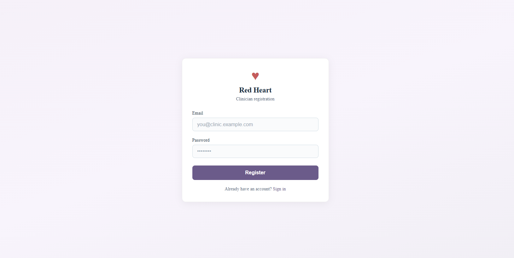

# ♥ Red Heart Frontend (React + Vite)

Mental health management — patient and clinician sign-in and registration.

## Screenshots

**Clinician registration**



## Run

Copy `.env.example` to `.env` and set your variables.

```bash
cd red-heart-frontend
copy .env.example .env   # Windows
npm install
npm run dev
```

App: http://localhost:5173

## Project structure

```
red-heart-frontend/
├── public/           # Static assets
│   └── assets/       # Images (e.g. screenshots)
├── src/
│   ├── api/          # API client (auth, token)
│   ├── components/   # Reusable UI components
│   ├── pages/        # Page components (Home, SignIn, Register, …)
│   ├── styles/      # CSS (Auth, global)
│   ├── App.jsx
│   └── main.jsx
├── index.html
├── vite.config.js
├── package.json
├── .env.example
└── README.md
```
